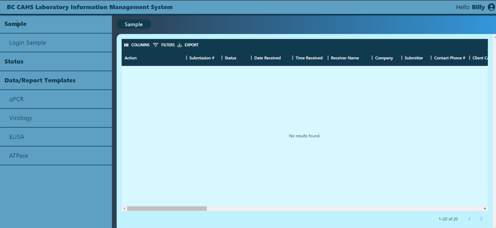
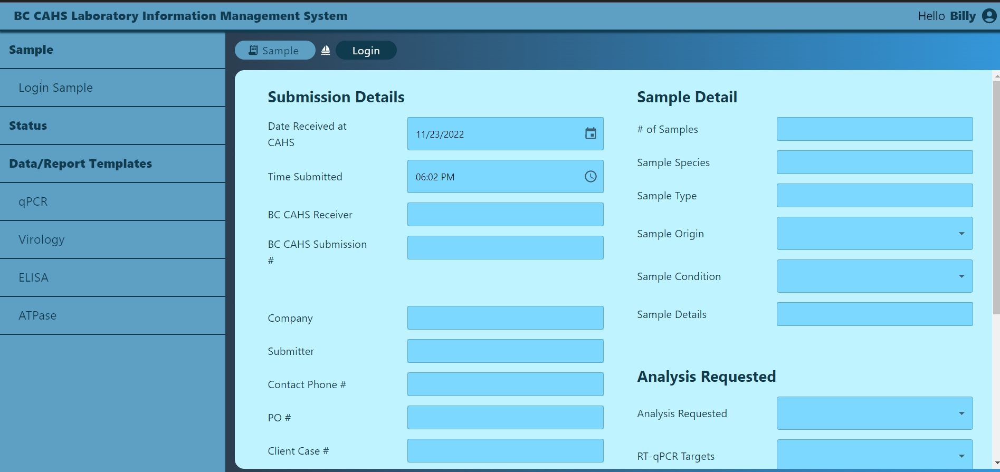
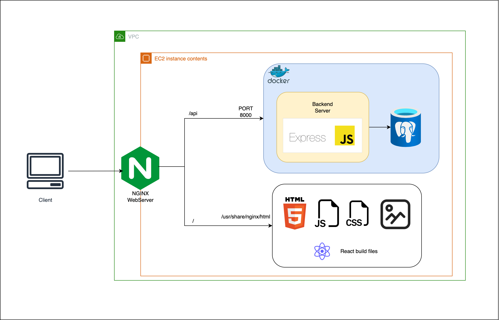

# COMP4800

  

### Built With

- [![Docker][docker.dev]][docker-url]
- [![React][react.js]][react-url]
- [![Material UI][materialui]][materialui-url]
- [![Postgres][postgresql]][postgres-url]
- [![Expressjs][expressjs]][express-url]

## About
**Note: Code is unavailable for view due to signed NDA**

This was a 12-week industry sponsored project partnered with my school. This project was completed in a team of 5 developers.
Our client wanted to digitize their manual method of inputting and managing client data. Having previously used Excel Spreadsheets to store records, our team designed a webapp that allowed lab technicians login/signup and input data through a front-end, storing records into a database. Users could also edit past records and visualize aggregate data. 

## My Contributions
- Designed and implemented relational database solution to store client data and handle queries on the back-end
- Used Figma to design mockups for client approval
- Integrated front-end forms to integrate with database and backend
- Created authentication features for secure login/signup
- Hosted on AWS for client demo usage
- Applied Agile workflow for continuous updates/deliverables

### High level architecture

<!-- MARKDOWN LINKS & IMAGES -->
<!-- https://www.markdownguide.org/basic-syntax/#reference-style-links -->

[product-screenshot]: images/screenshot.png
[react.js]: https://img.shields.io/badge/React-20232A?style=for-the-badge&logo=react&logoColor=61DAFB
[react-url]: https://reactjs.org/
[materialui]: https://img.shields.io/badge/Material_UI-4834d4?style=for-the-badge&logo=mui&logoColor=white
[materialui-url]: https://mui.com/
[docker.dev]: https://img.shields.io/badge/DOCKER-3498db?style=for-the-badge&logo=docker&logoColor=white
[docker-url]: https://www.docker.com/
[expressjs]: https://img.shields.io/badge/Express-f9ca24?style=for-the-badge&logo=express&logoColor=black
[express-url]: https://expressjs.com/
[postgres-url]: https://www.postgresql.org/
[postgresql]: https://img.shields.io/badge/PostgreSQL-dff9fb?style=for-the-badge&logo=postgresql&logoColor=black
